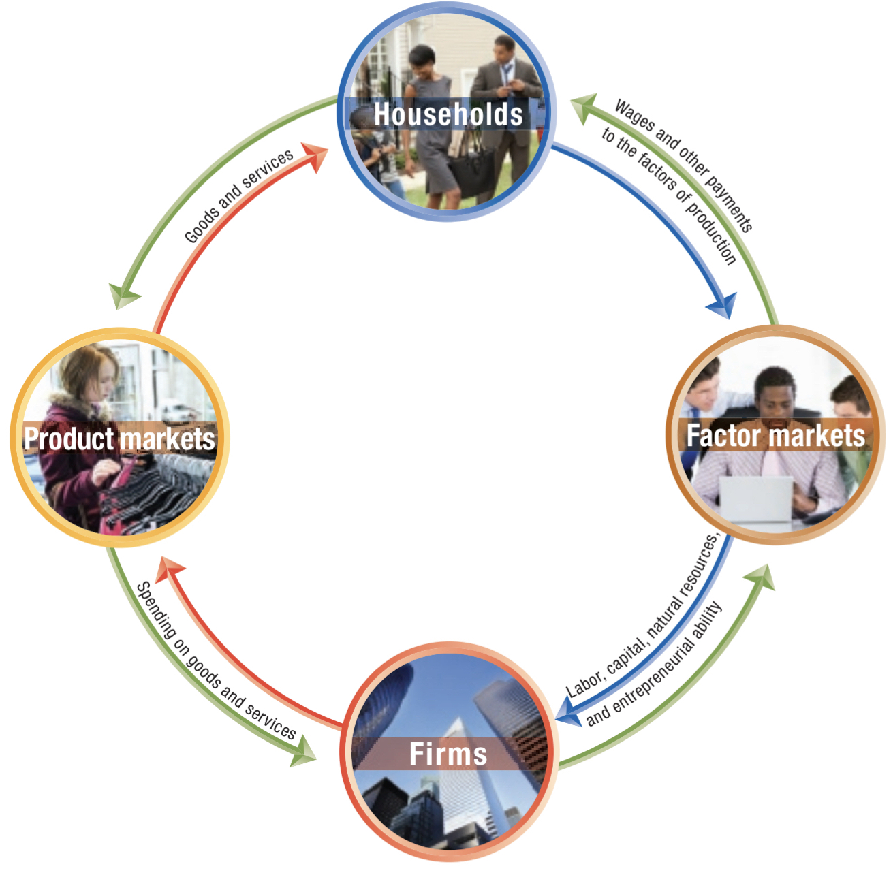

# Table of Contents

- [Table of Contents](#table-of-contents)
- [Chapter 2](#chapter-2)
  - [2.1](#21)
    - [GRAPHING A PPF](#graphing-a-ppf)
    - [INCREASING MARGINAL OPPORTUNITY COST](#increasing-marginal-opportunity-cost)
    - [ECONOMIC GROWTH](#economic-growth)
  - [2.2](#22)
    - [Specialization and Gains from trade](#specialization-and-gains-from-trade)
    - [Absolute advantage & comparative advantage in trade](#absolute-advantage--comparative-advantage-in-trade)
  - [2.3](#23)
    - [CIRCULAR FLOW OF INCOME](#circular-flow-of-income)
    - [The Gains from Free Markets](#the-gains-from-free-markets)
    - [The Market Mechanism](#the-market-mechanism)
    - [Legal basis of a Successful Market System](#legal-basis-of-a-successful-market-system)

# Chapter 2

- scarcity requires trade-offs
- factors of production (economic resources) are scarce

---
## 2.1

- **production possibilities frontier (_PPF_):** curve showing the maximum attainable
  combinations of 2 goods with available resources and current technology. It is also
  a great tool to visualize opportunity cost

  

### GRAPHING A PPF

to see example of writing PPF go to page 44

### INCREASING MARGINAL OPPORTUNITY COST

- ppf's are **bowed outwards** so changes along it are not linear
- as you move down the ppf you experience **marginal opportunity cost** because increasing one
  production requires larger and larger decreases in the other
- we can see that increases (or decreases) have an upper bound, where they are no longer larger:

the more resources already devoted to an activity, the smaller the payoff to devoting additional resources to it

  

### ECONOMIC GROWTH

- **capital stock:** amount of machinery and other physical capital available in an economy
- at any given time, the total resources available to an economy are fixed (capital stock included)
- **economic growth:** outward shifts in the PPF represent it because they allow the economy to increase
  its production, can be caused by:
  - population growth
  - technological advancements

---
## 2.2

- **trade:** the act of buying or selling, can be direct or indirect
- trade allows us to go outside the bounds of PPF's, increasing both production and consumption

### Specialization and Gains from trade

view example on page 48 and 49 (explained much better than I coudl ever)

### Absolute advantage & comparative advantage in trade

- **absolute advantage:** the ability to produce more of a good/service than competitors, given the same resources
- **comparative advantage:** the ability to produce goods/services at a lower opportunity cost than competitors

THE BASIS FOR TRAFE IS COMPARATIVE ADVANTAGE, NOT ABSOLUTE ADVANTAGE

  

- specialization should occur on goods/services in which the individual, firm or country
  has a comparative advantage and trade for the other goods/services

---
## 2.3

- **product market:** market for goods or services
- **factor market:** market for factors of production (inputs for production), 4 types:

| Labor | Capital | Natural resources | Entrepreneur |
| :----------: |:----------: |:----------: |:----------: |
| all types of work | physical capital computers, tools, buildings | land, water, oil, raw materials | business operator |

### CIRCULAR FLOW OF INCOME

  

- **households:** suppliers of factors of production, receive income from selling the factors
- **firms:** suppliers of goods and services, receive funds from selling to goods and services
- read Figure 2.6 on page 55
- things the model doesn't take into account:
  1. government activity
  2. financial systems for flow of funds
  3. trade (both in factor and product markets)

THE MARKET SYSTEM SUCCESSFULLY COORDINATES THE INDEPENDENT ACTIVITIES OF SO MANY HOUSEHOLDS AND FIRMS

  

### The Gains from Free Markets

- **free market:** market with few government restrictions, both in production and consumption
- FREE MARKETS ARE A BENCHMARK AGAINST ACTUAL ECONOMIES as governments intervene on all modern economies
- Adam Smith first argued that restrictionsreduce a countries income and wealth, thereby restricting the quality of goods produced
  
### The Market Mechanism

- the assumption must be made that individuals take actions that are most likely to make themselves better off financially
- when buying/selling, the motivation of financial reward usually provides the best explanation for actions taken
- customers' wants are flexible, thus the prices and firms have to be as well
- **relative price:** price of one good/service relative to other prices, good indicator for customer taste/preference
- **invisible hand:** Adam Smith's definition for how the market leads firms to provide consumers with the goods they want

firms respond individuallyto changes in prices by making decisions that collectively end up satisfying the preferences of consumers

  

### Legal basis of a Successful Market System

- **protection of private property**
- **property rights**
- **enforcement of contracts and property rights**