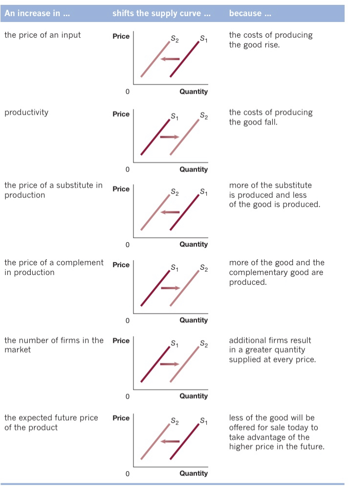

# Table of Contents

- [Table of Contents](#table-of-contents)
- [Chapter 3](#chapter-3)
  - [3.1 DEMAND](#31-demand)
    - [DEMAND SCHEDULES & CURVES](#demand-schedules--curves)
    - [VARIABLES THAT SHIFT DEMAND](#variables-that-shift-demand)
  - [3.2 SUPPLY](#32-supply)
    - [SUPPLY SCHEDULES & CURVES](#supply-schedules--curves)
    - [VARIABLES THAT SHIFT SUPPLY](#variables-that-shift-supply)
  - [3.3 EQUILIBRIUM](#33-equilibrium)
    - [SURPLUSES & SHORTAGES](#surpluses--shortages)
  - [3.4 EFFECTS ON SUPPLY & DEMAND SHIFTS](#34-effects-on-supply--demand-shifts)

# Chapter 3

- the market that will be used is a **perfectly competitive market:** a market in which:
  1. there are many buyers and sellers
  2. all firms sell identical products
  3. no entry barriers for new firms

## 3.1 DEMAND

- the most successful businesses are the ones that respond best to consumer demand
- a customer is limited by desire and ability (purchasing power)

### DEMAND SCHEDULES & CURVES

- **demand schedule:** table showing relationship between price and quantity demanded
- **quantity demanded:** amount a consumer is willing and able to purchase at a given price

| Price | Quantity |
| :-----: | :-----: |
| $2.50 | 3 |
| $2 | 4|
| $1.50| 5 |
| $1 | 6 |
| $0.50 | 7 |

- **market demand:** demand by all consumers (total demand)
- **demand curve:** curve that shows the relationship between price and quantity demanded

  

**LAW OF DEMAND**

HOLDING EVERYTHING ELSE CONSTANT, WHEN THE PRICE FALLS, THE QUANTITY DEMANDED INCREASES  
THE DEMAND CURVE ALWAYS HAS A DOWNWARD SLOPE

  

- **substitution effect:** the change in quantity demanded that results because a change in price
  makes the good/service more or less expensive relative to its substitutes
- **substitute:** goods/services that can be used for the same purpose
- **income effect:** the change in quantity demanded because a change in price has an impact on a
  consumers' purchasing power
- **purchasing power:** quantity of goods a consumer can buy with a fixed amount of income
- these 2 effects occur simultaneously whenever a price changes
- **Ceteris paribus:** the requirement that, when analyzing the relationship between 2 variables,
  other variables must be held constant
- **increase/decrease in demand:** a shift of the demand curve
- **increase/decrease in quantity demanded:** movment along a demand curve

### VARIABLES THAT SHIFT DEMAND

- income
- prices of related goods, substitutes and complements
- tastes
- population & demographics
- expected future prices
 

- **normal good:** good/service for which demand increases as income _increases_
- **inferior good:** good/service for which demand increases as income _falls_
- **substitute:** goods/services that can be used for the same purpose
- **complements:** goods/services that are used together

  

- **change in demand:** refers to the shift of the demand curve when one of the variables,
  other than price, changes 

## 3.2 SUPPLY

- **quantity supplied:** the amount a firm is willing and able to supply at a given price
- profitability rises with price

### SUPPLY SCHEDULES & CURVES

| Price | Quantity |
| :-----: | :-----: |
| $2.50 | 7 |
| $2 | 6 |
| $1.50| 5 |
| $1 | 4 |
| $0.50 | 3 |

- **supply schedule:** a table that shows the relationship betwenn price and quantity supplied
- **supply curve:** curving showing the relationship between price and quantity supplied

  

**LAW OF SUPPLY**

HOLDING EVERYTHING ELSE CONSTANT, WHEN THE PRICE INCREASES, THE QUANTITY SUPPLIED INCREASES  
THE DEMAND CURVE ALWAYS HAS AN UPWARD SLOPE

  

### VARIABLES THAT SHIFT SUPPLY

- prices of inputs
- technological change
- prices of related goods, substitutes and complements
- number of firms on the market
- expected future prices
 

  

- **change in supply:** refers to the shift of the supply curve when one of the variables,
  other than price, changes

---
## 3.3 EQUILIBRIUM

- **market equilibrium:** condition in which quantity demanded = quantity supplied
- **competitive market equilibrium:** market equilibrium with many buyers and sellers

### SURPLUSES & SHORTAGES

  

| Surplus | Shortage |
| :-------: | :-------: |
| Q supplied > Q demanded | Q demanded > Q supplied|
| prices are cut | prices are raised |

---
## 3.4 EFFECTS ON SUPPLY & DEMAND SHIFTS

  

- for more info go to page 90