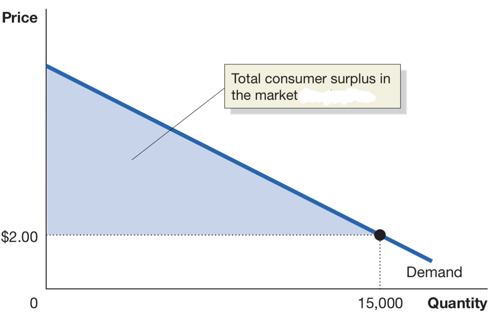
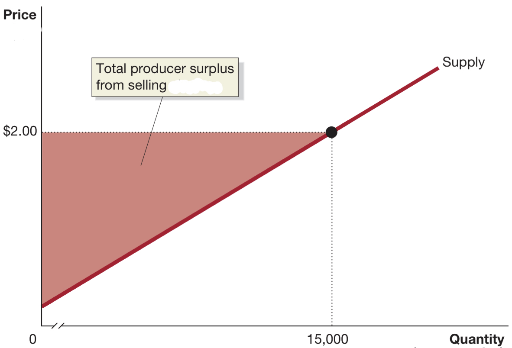
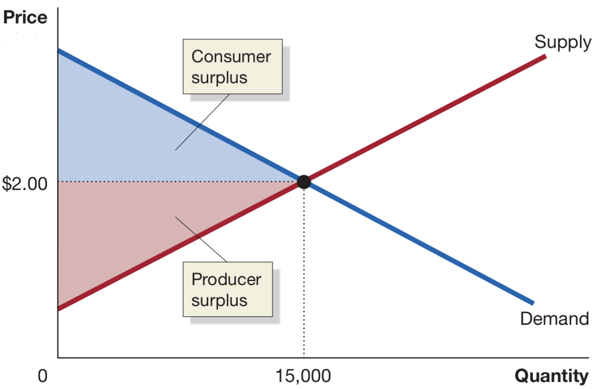
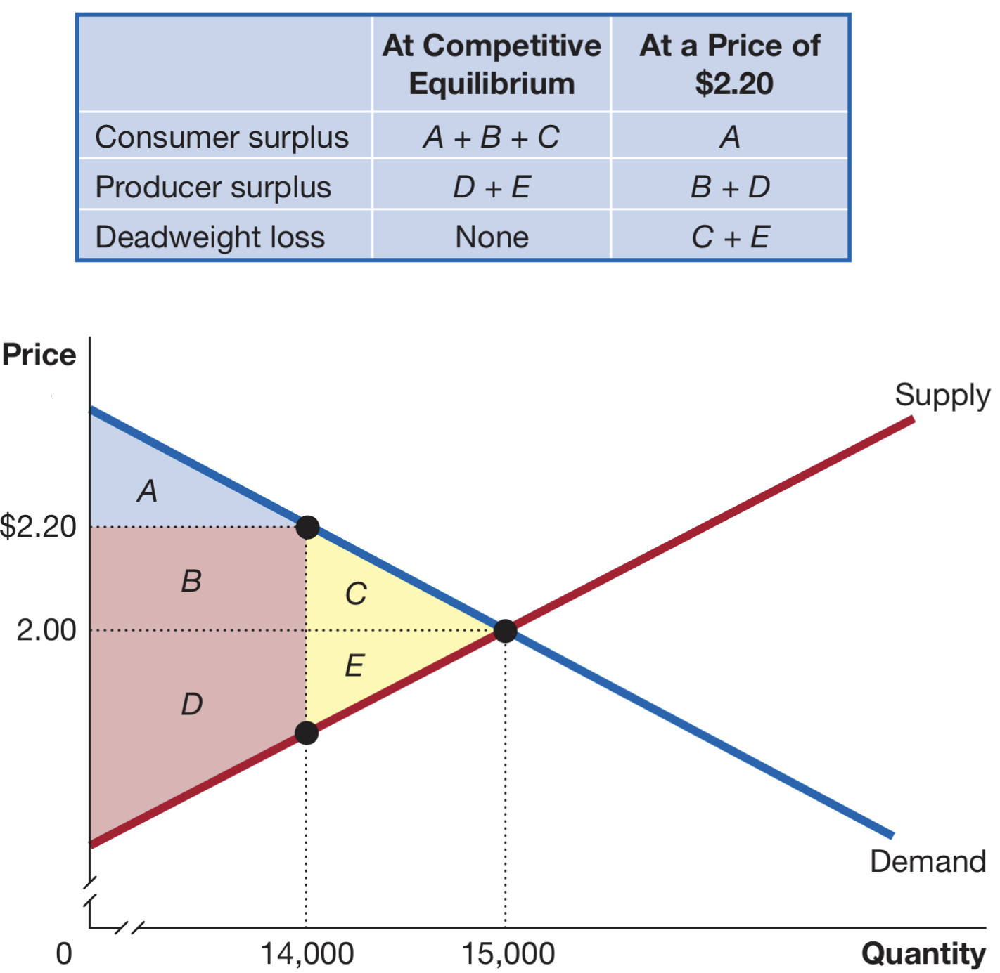

# Table of Contents

- [Table of Contents](#table-of-contents)
- [Chapter 4 SURPLUS](#chapter-4-surplus)
  - [4.1](#41)
    - [CONSUMER SURPLUS](#consumer-surplus)
    - [PRODUCER SURPLUS](#producer-surplus)
  - [4.2](#42)
    - [MC = MB IN COMPETITIVE EQUILIBRIUM](#mc--mb-in-competitive-equilibrium)
    - [ECONOMIC SURPLUS](#economic-surplus)
    - [DEADWEIGHT LOSS](#deadweight-loss)
    - [ECONOMIC SURPLUS AND EFFICIENCY](#economic-surplus-and-efficiency)
  - [4.3 GOVERNMENT INTERVENTION](#43-government-intervention)
    - [PRICE FLOORS](#price-floors)
    - [PRICE CEILINGS](#price-ceilings)
    - [BLACK MARKETS](#black-markets)
  - [4.4 ECONOMIC EFFECT OF TAXES](#44-economic-effect-of-taxes)
    - [WHO PAYS THE TAX?](#who-pays-the-tax)

# Chapter 4 SURPLUS

- customers want to pay the least, sellers want to earn the most
- **price ceiling:** legally determined maximum price sellers may charge
- **price floor:** legally determined minimun sellers may receive

## 4.1

### CONSUMER SURPLUS

- **consumer surplus:** highest price a consumer is willing to pay - actual price paid for good/service
- **marginal benefit:** additional benefit to a consumer from consuming one more unit of good/service
- graphically represented as _area below the demand curve and above the market price_:

  

### PRODUCER SURPLUS

- **marginal cost:** additional cost of producing one more unit of good/service
- **producer surplus:** lowest price willing to accept - actual price received
- graphically represented as _area above the supply curve and below the market price_:

  

consumer surplus measures the NET benefit to consumers from participating in a market, not TOTAL benefit  
producer surplus measures the NET benefit to producers from participating in a marlet, not TOTAL benefit  
NET refers to the difference between the TOTAL benefit (which would be the COMPLETE areas above/below the curves)
and the PRICE paid to produce/buy the good or service

## 4.2

- economic efficiency can be though in terms of marginal benefits and costs or surplus value, both consumer and producer

### MC = MB IN COMPETITIVE EQUILIBRIUM

- equilibrium in a competitive market results in the economically efficient level of output, at which marginal benefit equals marginal cost

### ECONOMIC SURPLUS

- **economic surplus:** the sum of consumer surplus and producer surplus

  

### DEADWEIGHT LOSS

- **deadweight loss:** the reduction in economic surplus resulting from the market not being in competitive equilibrium

  

### ECONOMIC SURPLUS AND EFFICIENCY

- equilibrium in a competitive market results in the great attainable amount of economic surplus
- **economic efficiency:** market outcome in which the marginal benefit to consumers of the last unit produced
  is equal to its marginal cost of production and in which the sum of consumer surplus and producer surplus is
  at a maximum

## 4.3 GOVERNMENT INTERVENTION

- up until now we've talked about global benefits, not about individuals (the single consumer/producer)
- government intervention can happen when imbalances are present

### PRICE FLOORS

- **price floor:** minimun legal price for a good

### PRICE CEILINGS

- **price ceiling:** maximum legal price for a good

### BLACK MARKETS

- **black market:** market in which buying/selling prices violate government regulations

## 4.4 ECONOMIC EFFECT OF TAXES

- **public finance:** field of economics that analyzes taxes
- **excess tax burden:** deadweight loss caused by implementing a tax
- **tax efficiency:** determined by the ratio between excess burden and tax revenue

### WHO PAYS THE TAX?

- **tax incidence:** the actual division of the burden between buyers and sellers in the market

legal obligation to pay the tax does not equal bearing the burden of paying the tax

