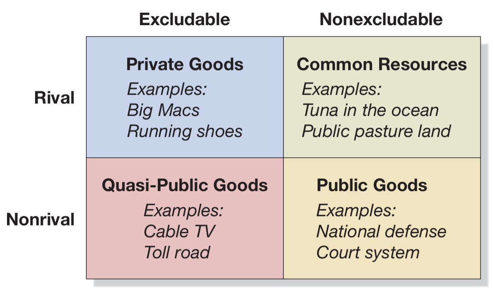

# Table of Contents

- [Table of Contents](#table-of-contents)
- [Chapter 5](#chapter-5)
  - [5.1 Externalities and economic efficiency](#51-externalities-and-economic-efficiency)
    - [Types of costs & benefits](#types-of-costs--benefits)
    - [Types of externalities](#types-of-externalities)
    - [Market failure](#market-failure)
    - [Causes of externalities](#causes-of-externalities)
  - [5.2 Coase Theorem](#52-coase-theorem)
    - [Coase Theorem](#coase-theorem)
  - [5.3 Government intervention](#53-government-intervention)
    - [Taxing negative externalities](#taxing-negative-externalities)
    - [Subsidizing positive externalities](#subsidizing-positive-externalities)
    - [Command & Control vs. Market-Based](#command--control-vs-market-based)
  - [5.4 4 categories of goods](#54-4-categories-of-goods)
    - [Demand for public goods](#demand-for-public-goods)
  - [Lindahl](#lindahl)

# Chapter 5

- **externality:** a benefit or cost that indirectly affects parties other than producers/consumers

- externalities interfere with economic efficiency of a market equilibrium

## 5.1 Externalities and economic efficiency

### Types of costs & benefits

- **private cost:** cost borne by producer
- **social cost:** cost of producing, equal to private cost plus external cost (such as pollution produced)
- both are equal unless an externality interferes

- **private benefit:** benefit received by consumer
- **social benefit:** total benefit from consumption, private benefit + external benefits (such as college education)
- both are equal unless and externality interferes

### Types of externalities

|  | Positive | Negative |
| :---------: | :---------: | :---------: |
| Consumers | Riding buses | Second-hand smoke |
| Producers | Orchard pollen | Air pollution | 

### Market failure

- externalities deprive markets of an efficient level of output

- **market failure:** situation in which the efficient level of output is not produced

### Causes of externalities

- **property rights:** rights to have exclusive use of property, including buy/sell rights
  
- a market system functions well when property rights are guaranteed
- property rights guarantee equality between social/private benefits and costs
  
- property rights can be difficult to enforce, be incomplete or be absent (college education for example)

## 5.2 Coase Theorem

- **economic efficient levels:** all decisions have to be made balancing _marginal costs_ & _marginal benefits_
- **net benefit:** the resulting benefit from a decision, difference between costs and benefits of that decision

go to page 152 and read _The Economically Efficient Level of Pollution Reduction_
- the idea is that reductions reach a point where they are no longer rational

- when large parties are inolved in these decisions the **transactions costs** are high
- **transactions costs:** costs in time and other resources that the parties incur 

### Coase Theorem

If transaction costs are low, private bargaining will result in an efficient solution to the problem of externalities

 

- all parties must be aware of all the costs and benefits relevant to the decision

## 5.3 Government intervention

### Taxing negative externalities

- a negative production externality can be solved with a tax equal to the cost of the externality
- producers will _internalize_ the cost of the externality

### Subsidizing positive externalities

- a positive consumption externality can be solved with a subsidy equal to the cost of the exteranlity
- consumers will _internalize_  the cost of the externality

### Command & Control vs. Market-Based

- governments usually adopt a **command and control** strategy instead of a market-based approach
- **command and control:** the government imposes quantitative limits on the production of firms, directly (quotas) or indirectly (limiting the amount of byeproducts)

## 5.4 4 categories of goods

  

- **rivalry:** one's consumption of a unit means no one else can consume that unit
- **excludability:** access is restricted by payment

### Demand for public goods

- **public good:** nonexcludable and nonrivalrous good
- they are prone to _free-riding_ (class group projects)
- markets don't decide who gets them, everybody does

## Lindahl

- proposed to share the cost between each consumers willingness to pay for it
- individual demand curves should be added vertically
- Lindahl equilibrium is prone to lying, about one's willingness to pay for the public good