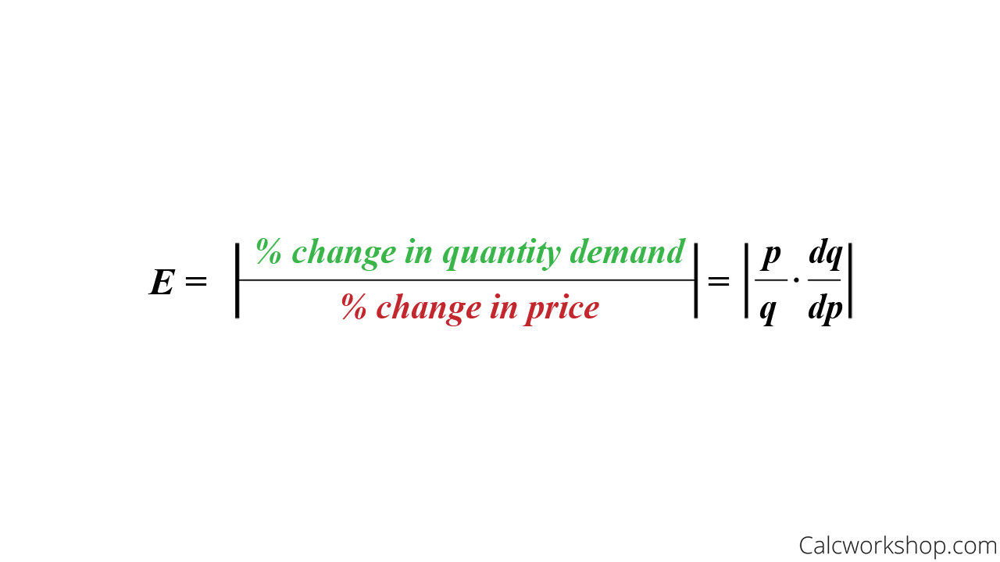

# Table of Contents

- [Table of Contents](#table-of-contents)
- [Chapter 6](#chapter-6)
  - [6.1 Demand Elasticity](#61-demand-elasticity)
    - [Examples](#examples)
    - [Revenue and elasticity](#revenue-and-elasticity)
  - [6.3 Total revenue & elasticity](#63-total-revenue--elasticity)
  - [6.4 Other elasticities](#64-other-elasticities)
    - [Cross-price elasticity](#cross-price-elasticity)
    - [Income elasticity](#income-elasticity)
  - [6.6 Supply elasticity](#66-supply-elasticity)

# Chapter 6

- **elasticity:** measure of how much one economic variable responds to changes in another economic variable

## 6.1 Demand Elasticity

- **demand elasticity:** impact of a change in price on the quantity demanded
- calculated as the percent change in Q divided by the percent change in P

### Examples

- elasticity of 2 means that a 1% increase in P causes a 2% decrease in Q
- elasticity of 0.5 means that a 1% increase in P causes a 0.5 decrease in Q

### Revenue and elasticity

|||
|:---:|:---:|
| Elasticity > 1 | elastic |
| Elasticity = 1 | unit elasticity |
| Elasticity < 1 | inelastic |

 

Flatter curves are more elastic, steeper curves are less elastic

## 6.3 Total revenue & elasticity

- **total revenue:** price per unit * units sold; PPU * US

|||
|:---:|:---:|
| elastic | revenue increases as price falls |
| unit elasticity | maximum revenue |
| inelastic | revenue increases as price rises |

## 6.4 Other elasticities

### Cross-price elasticity

- **cross-price elasticity:** percentage change in quantity demanded divided by the percentage change in price of another good

### Income elasticity

- **income elasticiyty:** percentage change in the quantity demanded divided by the percentage change in income

## 6.6 Supply elasticity

- **supply elasticity:** impact of a change in price on the supply
- calculated as the percentage change in S divided by the percent change in P

