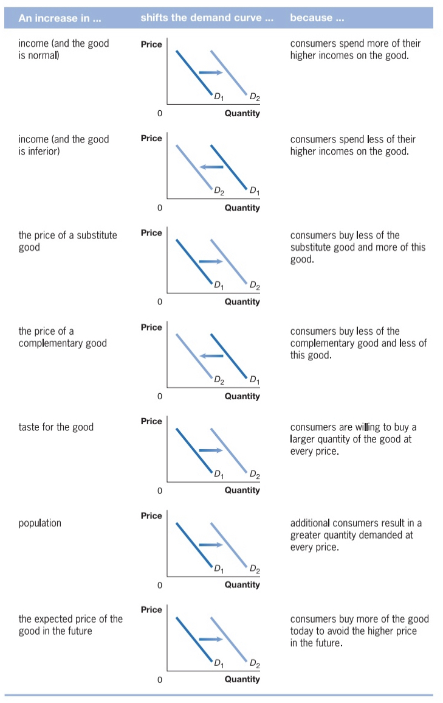
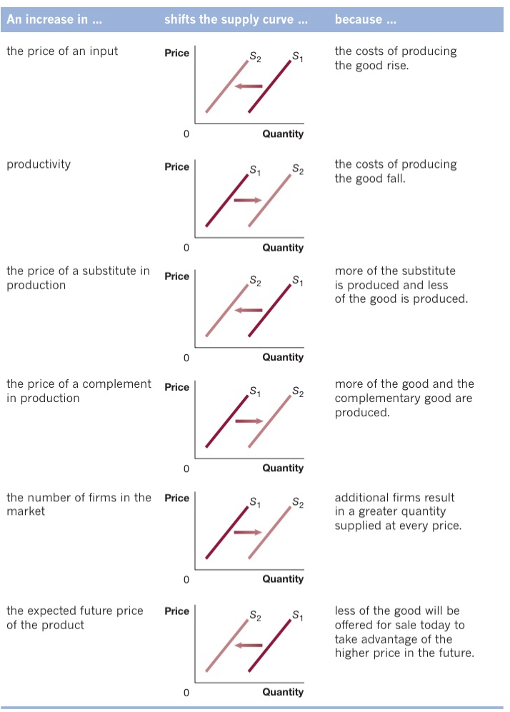
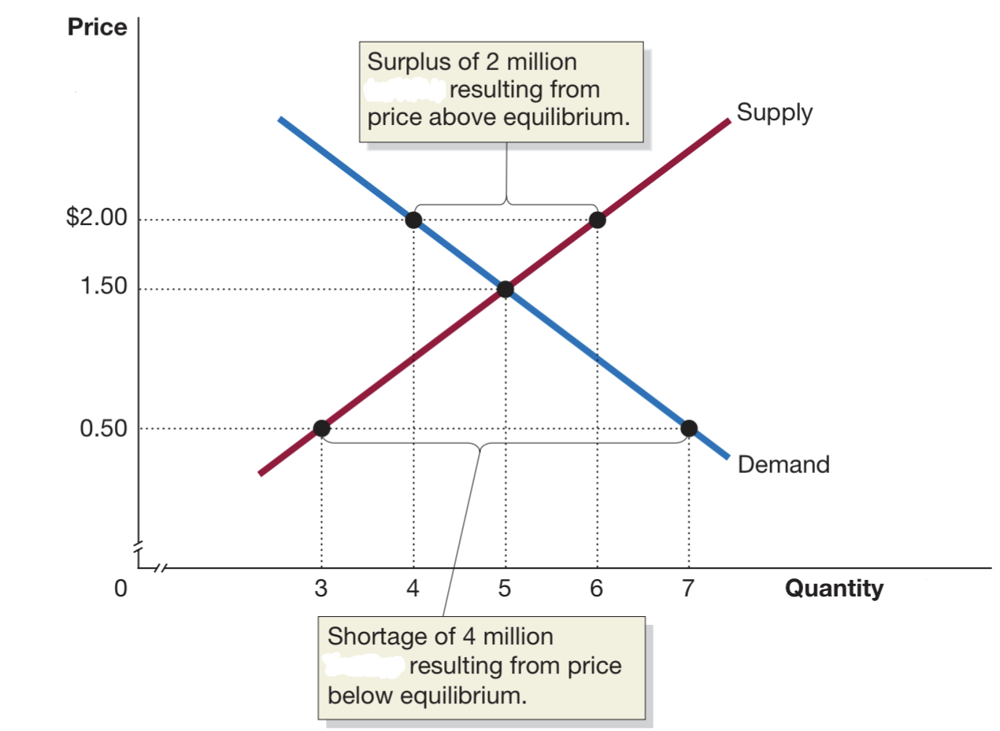
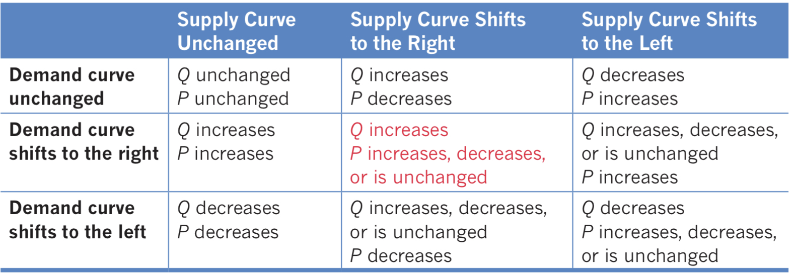
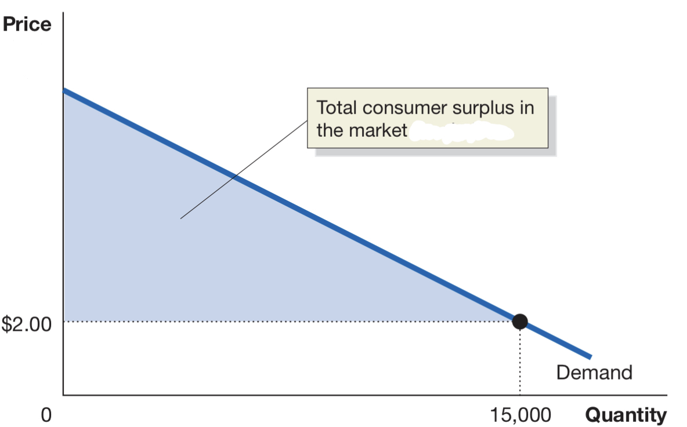
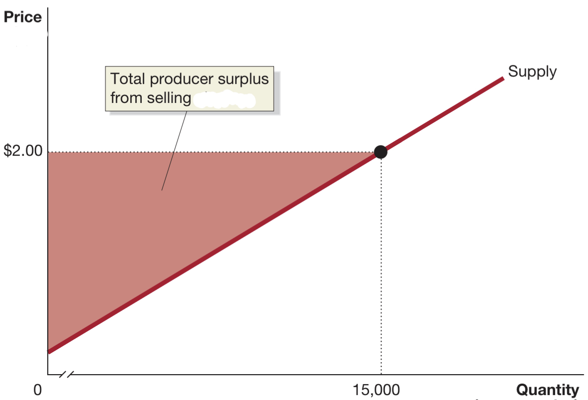
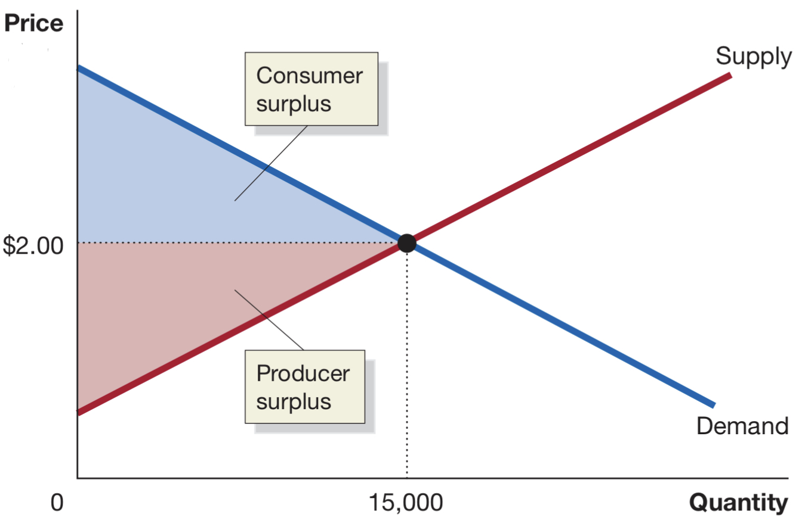
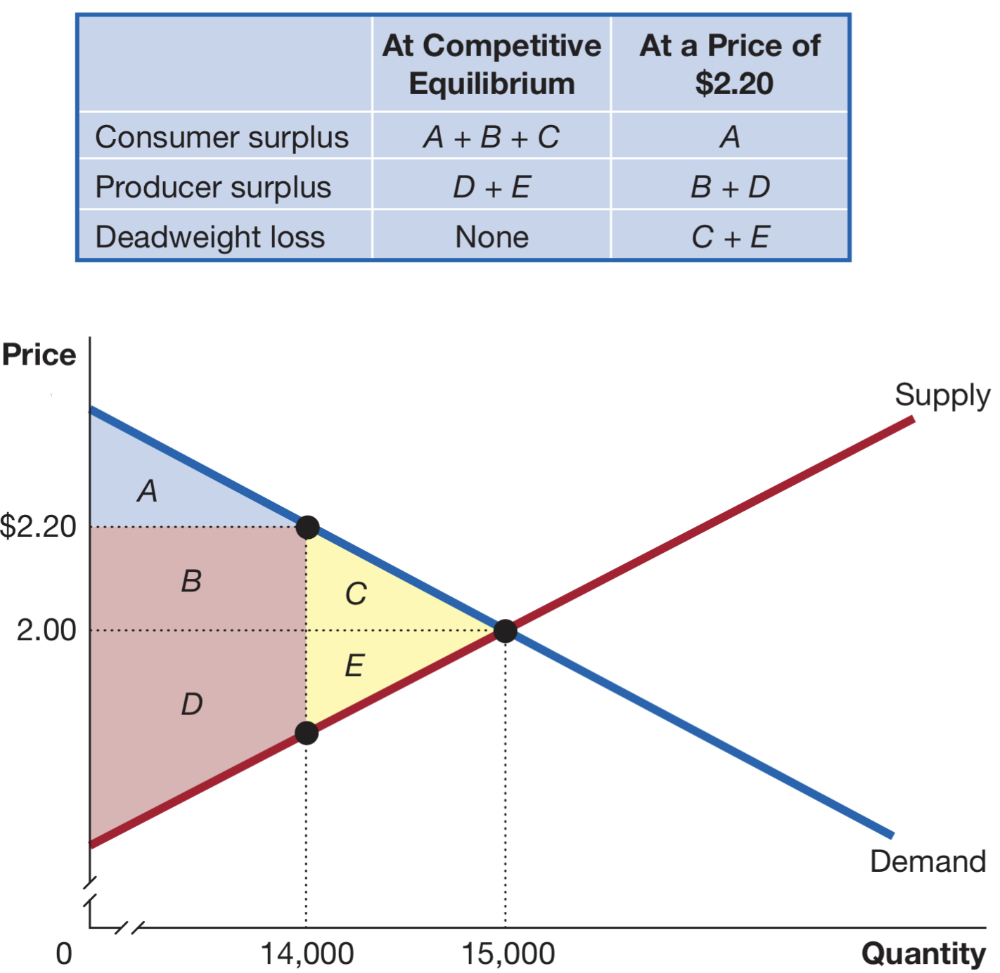

# Table of Contents

- [Table of Contents](#table-of-contents)
- [Chapter 1](#chapter-1)
  - [1.1](#11)
  - [1.2](#12)
    - [SCARCITY DEMANDS THE EXISTENCE OF **TRADE-OFFS**](#scarcity-demands-the-existence-of-trade-offs)
    - [CENTRALLY PLANNED, MARKET, AND MIXED ECONOMIES](#centrally-planned-market-and-mixed-economies)
    - [EFFICIENCY AND EQUITY](#efficiency-and-equity)
  - [1.3](#13)
    - [ECONOMIC MODELS (OR THEORIES)](#economic-models-or-theories)
    - [POSITIVE AND NORMATIVE ANALYSIS](#positive-and-normative-analysis)
  - [1.4](#14)
  - [1.5](#15)
  - [1.6](#16)
    - [GO TO PAGE 17 FOR IMPORTANT ECONOMIC TERMS](#go-to-page-17-for-important-economic-terms)
- [Chapter 2](#chapter-2)
  - [2.1](#21)
    - [GRAPHING A PPF](#graphing-a-ppf)
    - [INCREASING MARGINAL OPPORTUNITY COST](#increasing-marginal-opportunity-cost)
    - [ECONOMIC GROWTH](#economic-growth)
  - [2.2](#22)
    - [Specialization and Gains from trade](#specialization-and-gains-from-trade)
    - [Absolute advantage & comparative advantage in trade](#absolute-advantage--comparative-advantage-in-trade)
  - [2.3](#23)
    - [CIRCULAR FLOW OF INCOME](#circular-flow-of-income)
    - [The Gains from Free Markets](#the-gains-from-free-markets)
    - [The Market Mechanism](#the-market-mechanism)
    - [Legal basis of a Successful Market System](#legal-basis-of-a-successful-market-system)
- [Chapter 3](#chapter-3)
  - [3.1 DEMAND](#31-demand)
    - [DEMAND SCHEDULES & CURVES](#demand-schedules--curves)
    - [VARIABLES THAT SHIFT DEMAND](#variables-that-shift-demand)
  - [3.2 SUPPLY](#32-supply)
    - [SUPPLY SCHEDULES & CURVES](#supply-schedules--curves)
    - [VARIABLES THAT SHIFT SUPPLY](#variables-that-shift-supply)
  - [3.3 EQUILIBRIUM](#33-equilibrium)
    - [SURPLUSES & SHORTAGES](#surpluses--shortages)
  - [3.4 EFFECTS ON SUPPLY & DEMAND SHIFTS](#34-effects-on-supply--demand-shifts)
- [Chapter 4 SURPLUS](#chapter-4-surplus)
  - [4.1](#41)
    - [CONSUMER SURPLUS](#consumer-surplus)
    - [PRODUCER SURPLUS](#producer-surplus)
  - [4.2](#42)
    - [MC = MB IN COMPETITIVE EQUILIBRIUM](#mc--mb-in-competitive-equilibrium)
    - [ECONOMIC SURPLUS](#economic-surplus)
    - [DEADWEIGHT LOSS](#deadweight-loss)
    - [ECONOMIC SURPLUS AND EFFICIENCY](#economic-surplus-and-efficiency)
  - [4.3 GOVERNMENT INTERVENTION](#43-government-intervention)
    - [PRICE FLOORS](#price-floors)
    - [PRICE CEILINGS](#price-ceilings)
    - [BLACK MARKETS](#black-markets)
  - [4.4 ECONOMIC EFFECT OF TAXES](#44-economic-effect-of-taxes)
    - [WHO PAYS THE TAX?](#who-pays-the-tax)

# Chapter 1

- **scarcity:** unlimited wants exceed limited resources -> wants can't be fulfilled
- **economics:** study of the choices consumers make to attain their goals, given scarce resources
- **economic model:** simplified version of reality used to analyze real-world economic situations

- **market:** group of buyers and sellers of goods/services and the institution/arrangement that connects them

---
## 1.1 

PEOPLE ARE RATIONAL, PEOPLE RESPOND TO ECONOMIC INCENTIVES, OPTIMAL DECISIONS ARE MADE AT THE MARGIN

  

1. **people are rational:** consumers and firms use available information to achieve their goals

RATIONAL != BEST

   

2. **people respond to economic incentives:** people analyze the costs and benefits of their actions
3. **optimal decisions are made at the margin:** _most_ decisions in life invovle doing a little more or a little less, they are not "all or nothing" decisions

the optimal decision is to continue an action until the marginal benefits equal the marginal costs: MC = MB

---
## 1.2

### SCARCITY DEMANDS THE EXISTENCE OF **TRADE-OFFS**

- **trade-off:** producing more of one good/service means producing less of another, as we'll see with [PPF's](#21)
- **opportunity cost:** measure of trade-offs in production, defined as "the highest-valued alternative that must be given
up to engage in that activity"

WHAT will be produced?
HOW will it be produced?
WHO will receive what is produced?

  

1. **WHAT** is produced is decided by the consumers and the people working within firms and government.
Consumers decide what to buy, thus deciding what will be produced. Firms/governments decide where to allocate
their resources for production.
2. **HOW** the goods will be produced is decided by firms. The trade-offs faced concern the allocation of resources.
3. **WHO** receives the goods and services depends on income distribution within the population. More income, more purchasing power.

### CENTRALLY PLANNED, MARKET, AND MIXED ECONOMIES

| Centrally planned economy | Market economy | Mixed economy |
| :-----------------------: | :-----------------------: | :-----------------------: |
| Economy in which the government decides   allocation of economic resources| Economy in which the decisions of households and firms interacting   in markets allocate economic resources | Economy in which most decisions result from the interaction between buyers and   sellers, government intervenes in resource allocation |

- in a market economy firms have to follow the wants of consumers, or go out of business,
**consumers ultimately decide what will be produced**
- firms compete to produce the **highest quality at the lowest price**

WHO RECEIVES WHAT IS PRODUCED? -> THOSE WHO ARE MOST WILLING AND ABLE TO BUY THEM.

  

### EFFICIENCY AND EQUITY

- **productive efficiency:** good or service is produced at the lowest possible cost ->
  achieved with interaction between firms
- **allocative efficiency:** production is in accordance with consumer taste ->
  competition among firms and voluntary exchange results in most requested goods/services being produced
- **voluntary exchange:** situation where both buyer and seller are made better off by the transaction

ALL MARKETS PROMOTE EFFICIENCY, THEY DON'T GUARANTEE IT

  

- **inefficiency** can arise from a variety of sources
  - new product being produced -> takes time to optimize
  - government interference

- **equity:** the fair distribution of economic benefits

---
## 1.3

### ECONOMIC MODELS (OR THEORIES)

- models are used to make economic ideas sufficiently explicit and concrete so they can be used to make decisions.

- in order to **develop a model**:
  1. decide on the assumptions to use
  2. formulate a testable hypothesis
  3. use economic data to test hypothesis
  4. revise model (if test fails)
  5. retain the model to answer similar questions in the future

- **behavioral assumptions** about a parties **motives** are at the base of these models
  - firms -> maximize profits
  - consumers -> maximize benefits/satisfaction

- **economic variable:** something measureable that can have different values (people employed in manufacturing)
- **hypothesis:** statement about an economic variable that is true or false
- **casual relationship:** the hypothesis concerns a relationship in which one event CAUSES an effect

### POSITIVE AND NORMATIVE ANALYSIS

- **positive analysis:** analysis of WHAT IS
- **normative analysis:** analysis of WHAT WILL BE

economics is about positive analysis, measuring the costs and benefits of different courses of action

  

- economics is a social science concerned with how decisions of individuals explain different outcomes

---
## 1.4

| Microeconomics | Macroeconomics |
| :-----------------------: | :-----------------------: |
| how households and firms make choices how they interact in markets how governments intervene/influenece | economy as a whole (inflation, unemployment, and economic growth) |

- many situations have both microeconomic and macroeconomic aspects
  
---
## 1.5

---
## 1.6

### GO TO PAGE 17 FOR IMPORTANT ECONOMIC TERMS

---
# Chapter 2

- scarcity requires trade-offs
- factors of production (economic resources) are scarce

---
## 2.1

- **production possibilities frontier (_PPF_):** curve showing the maximum attainable
  combinations of 2 goods with available resources and current technology. It is also
  a great tool to visualize opportunity cost

  

### GRAPHING A PPF

to see example of writing PPF go to page 44

### INCREASING MARGINAL OPPORTUNITY COST

- ppf's are **bowed outwards** so changes along it are not linear
- as you move down the ppf you experience **marginal opportunity cost** because increasing one
  production requires larger and larger decreases in the other
- we can see that increases (or decreases) have an upper bound, where they are no longer larger:

the more resources already devoted to an activity, the smaller the payoff to devoting additional resources to it

  

### ECONOMIC GROWTH

- **capital stock:** amount of machinery and other physical capital available in an economy
- at any given time, the total resources available to an economy are fixed (capital stock included)
- **economic growth:** outward shifts in the PPF represent it because they allow the economy to increase
  its production, can be caused by:
  - population growth
  - technological advancements

---
## 2.2

- **trade:** the act of buying or selling, can be direct or indirect
- trade allows us to go outside the bounds of PPF's, increasing both production and consumption

### Specialization and Gains from trade

view example on page 48 and 49 (explained much better than I coudl ever)

### Absolute advantage & comparative advantage in trade

- **absolute advantage:** the ability to produce more of a good/service than competitors, given the same resources
- **comparative advantage:** the ability to produce goods/services at a lower opportunity cost than competitors

THE BASIS FOR TRAFE IS COMPARATIVE ADVANTAGE, NOT ABSOLUTE ADVANTAGE

  

- specialization should occur on goods/services in which the individual, firm or country
  has a comparative advantage and trade for the other goods/services

---
## 2.3

- **product market:** market for goods or services
- **factor market:** market for factors of production (inputs for production), 4 types:

| Labor | Capital | Natural resources | Entrepreneur |
| :----------: |:----------: |:----------: |:----------: |
| all types of work | physical capital computers, tools, buildings | land, water, oil, raw materials | business operator |

### CIRCULAR FLOW OF INCOME

  

- **households:** suppliers of factors of production, receive income from selling the factors
- **firms:** suppliers of goods and services, receive funds from selling to goods and services
- read Figure 2.6 on page 55
- things the model doesn't take into account:
  1. government activity
  2. financial systems for flow of funds
  3. trade (both in factor and product markets)

THE MARKET SYSTEM SUCCESSFULLY COORDINATES THE INDEPENDENT ACTIVITIES OF SO MANY HOUSEHOLDS AND FIRMS

  

### The Gains from Free Markets

- **free market:** market with few government restrictions, both in production and consumption
- FREE MARKETS ARE A BENCHMARK AGAINST ACTUAL ECONOMIES as governments intervene on all modern economies
- Adam Smith first argued that restrictionsreduce a countries income and wealth, thereby restricting the quality of goods produced
  
### The Market Mechanism

- the assumption must be made that individuals take actions that are most likely to make themselves better off financially
- when buying/selling, the motivation of financial reward usually provides the best explanation for actions taken
- customers' wants are flexible, thus the prices and firms have to be as well
- **relative price:** price of one good/service relative to other prices, good indicator for customer taste/preference
- **invisible hand:** Adam Smith's definition for how the market leads firms to provide consumers with the goods they want

firms respond individuallyto changes in prices by making decisions that collectively end up satisfying the preferences of consumers

  

### Legal basis of a Successful Market System

- **protection of private property**
- **property rights**
- **enforcement of contracts and property rights**

---
# Chapter 3

- the market that will be used is a **perfectly competitive market:** a market in which:
  1. there are many buyers and sellers
  2. all firms sell identical products
  3. no entry barriers for new firms

## 3.1 DEMAND

- the most successful businesses are the ones that respond best to consumer demand
- a customer is limited by desire and ability (purchasing power)

### DEMAND SCHEDULES & CURVES

- **demand schedule:** table showing relationship between price and quantity demanded
- **quantity demanded:** amount a consumer is willing and able to purchase at a given price

| Price | Quantity |
| :-----: | :-----: |
| $2.50 | 3 |
| $2 | 4|
| $1.50| 5 |
| $1 | 6 |
| $0.50 | 7 |

- **market demand:** demand by all consumers (total demand)
- **demand curve:** curve that shows the relationship between price and quantity demanded

  

**LAW OF DEMAND**

HOLDING EVERYTHING ELSE CONSTANT, WHEN THE PRICE FALLS, THE QUANTITY DEMANDED INCREASES  
THE DEMAND CURVE ALWAYS HAS A DOWNWARD SLOPE

  

- **substitution effect:** the change in quantity demanded that results because a change in price
  makes the good/service more or less expensive relative to its substitutes
- **substitute:** goods/services that can be used for the same purpose
- **income effect:** the change in quantity demanded because a change in price has an impact on a
  consumers' purchasing power
- **purchasing power:** quantity of goods a consumer can buy with a fixed amount of income
- these 2 effects occur simultaneously whenever a price changes
- **Ceteris paribus:** the requirement that, when analyzing the relationship between 2 variables,
  other variables must be held constant
- **increase/decrease in demand:** a shift of the demand curve
- **increase/decrease in quantity demanded:** movment along a demand curve

### VARIABLES THAT SHIFT DEMAND

- income
- prices of related goods, substitutes and complements
- tastes
- population & demographics
- expected future prices
 

- **normal good:** good/service for which demand increases as income _increases_
- **inferior good:** good/service for which demand increases as income _falls_
- **substitute:** goods/services that can be used for the same purpose
- **complements:** goods/services that are used together

  

- **change in demand:** refers to the shift of the demand curve when one of the variables,
  other than price, changes 

## 3.2 SUPPLY

- **quantity supplied:** the amount a firm is willing and able to supply at a given price
- profitability rises with price

### SUPPLY SCHEDULES & CURVES

| Price | Quantity |
| :-----: | :-----: |
| $2.50 | 7 |
| $2 | 6 |
| $1.50| 5 |
| $1 | 4 |
| $0.50 | 3 |

- **supply schedule:** a table that shows the relationship betwenn price and quantity supplied
- **supply curve:** curving showing the relationship between price and quantity supplied

  

**LAW OF SUPPLY**

HOLDING EVERYTHING ELSE CONSTANT, WHEN THE PRICE INCREASES, THE QUANTITY SUPPLIED INCREASES  
THE DEMAND CURVE ALWAYS HAS AN UPWARD SLOPE

  

### VARIABLES THAT SHIFT SUPPLY

- prices of inputs
- technological change
- prices of related goods, substitutes and complements
- number of firms on the market
- expected future prices
 

  

- **change in supply:** refers to the shift of the supply curve when one of the variables,
  other than price, changes

---
## 3.3 EQUILIBRIUM

- **market equilibrium:** condition in which quantity demanded = quantity supplied
- **competitive market equilibrium:** market equilibrium with many buyers and sellers

### SURPLUSES & SHORTAGES

  

| Surplus | Shortage |
| :-------: | :-------: |
| Q supplied > Q demanded | Q demanded > Q supplied|
| prices are cut | prices are raised |

---
## 3.4 EFFECTS ON SUPPLY & DEMAND SHIFTS

  

- for more info go to page 90

---
# Chapter 4 SURPLUS

- customers want to pay the least, sellers want to earn the most
- **price ceiling:** legally determined maximum price sellers may charge
- **price floor:** legally determined minimun sellers may receive

## 4.1

### CONSUMER SURPLUS

- **consumer surplus:** highest price a consumer is willing to pay - actual price paid for good/service
- **marginal benefit:** additional benefit to a consumer from consuming one more unit of good/service
- graphically represented as _area below the demand curve and above the market price_:

  

### PRODUCER SURPLUS

- **marginal cost:** additional cost of producing one more unit of good/service
- **producer surplus:** lowest price willing to accept - actual price received
- graphically represented as _area above the supply curve and below the market price_:

  

consumer surplus measures the NET benefit to consumers from participating in a market, not TOTAL benefit  
producer surplus measures the NET benefit to producers from participating in a marlet, not TOTAL benefit  
NET refers to the difference between the TOTAL benefit (which would be the COMPLETE areas above/below the curves)
and the PRICE paid to produce/buy the good or service

## 4.2

- economic efficiency can be though in terms of marginal benefits and costs or surplus value, both consumer and producer

### MC = MB IN COMPETITIVE EQUILIBRIUM

- equilibrium in a competitive market results in the economically efficient level of output, at which marginal benefit equals marginal cost

### ECONOMIC SURPLUS

- **economic surplus:** the sum of consumer surplus and producer surplus

  

### DEADWEIGHT LOSS

- **deadweight loss:** the reduction in economic surplus resulting from the market not being in competitive equilibrium

  

### ECONOMIC SURPLUS AND EFFICIENCY

- equilibrium in a competitive market results in the great attainable amount of economic surplus
- **economic efficiency:** market outcome in which the marginal benefit to consumers of the last unit produced
  is equal to its marginal cost of production and in which the sum of consumer surplus and producer surplus is
  at a maximum

## 4.3 GOVERNMENT INTERVENTION

- up until now we've talked about global benefits, not about individuals (the single consumer/producer)
- government intervention can happen when imbalances are present

### PRICE FLOORS

- **price floor:** minimun legal price for a good

### PRICE CEILINGS

- **price ceiling:** maximum legal price for a good

### BLACK MARKETS

- **black market:** market in which buying/selling prices violate government regulations

## 4.4 ECONOMIC EFFECT OF TAXES

- **public finance:** field of economics that analyzes taxes
- **excess tax burden:** deadweight loss caused by implementing a tax
- **tax efficiency:** determined by the ratio between excess burden and tax revenue

### WHO PAYS THE TAX?

- **tax incidence:** the actual division of the burden between buyers and sellers in the market

legal obligation to pay the tax does not equal bearing the burden of paying the tax

