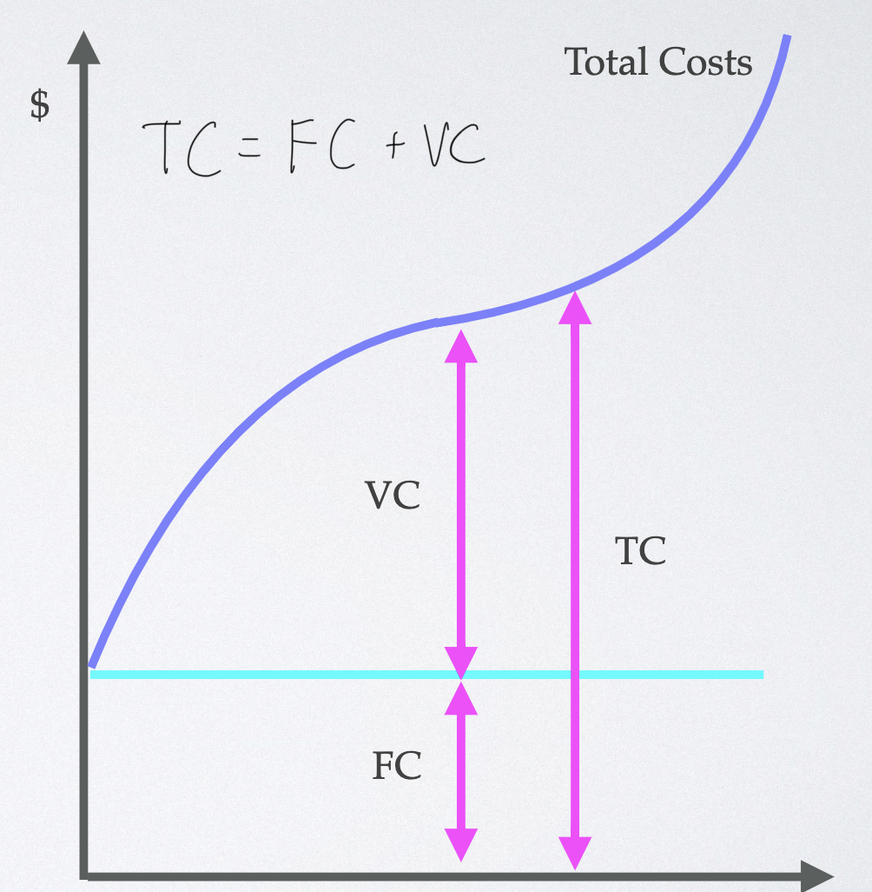
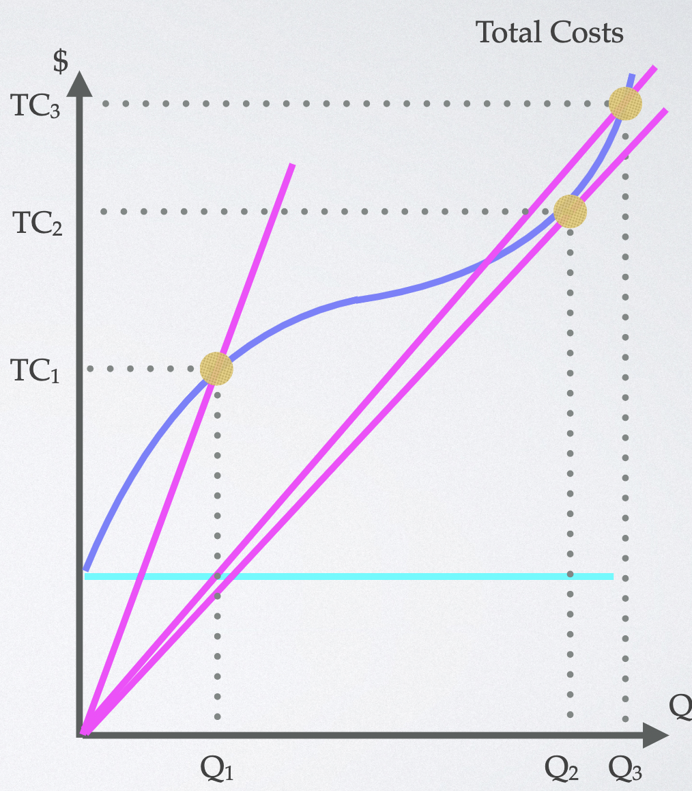
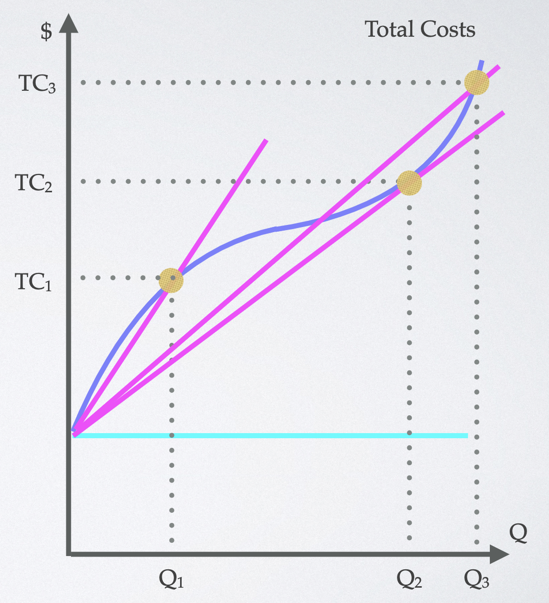
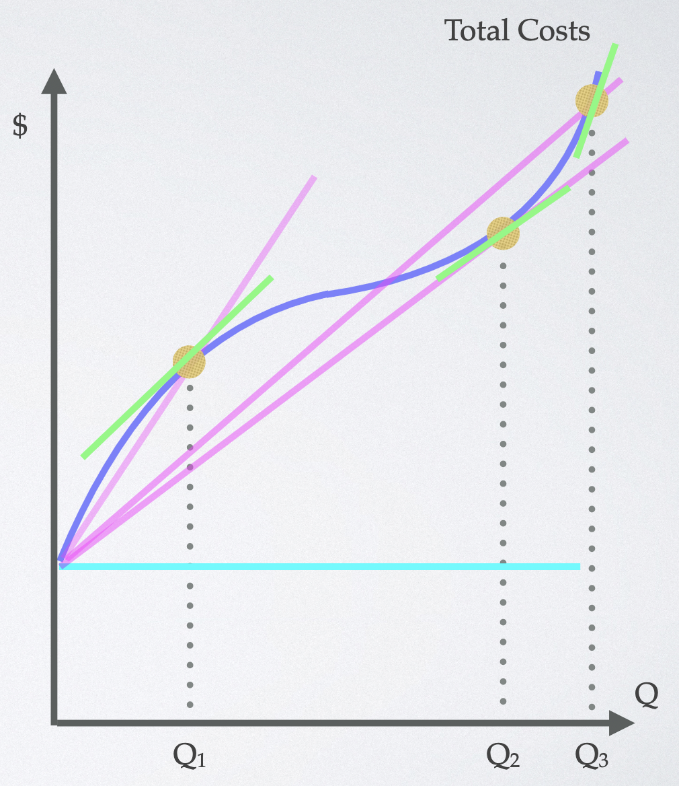
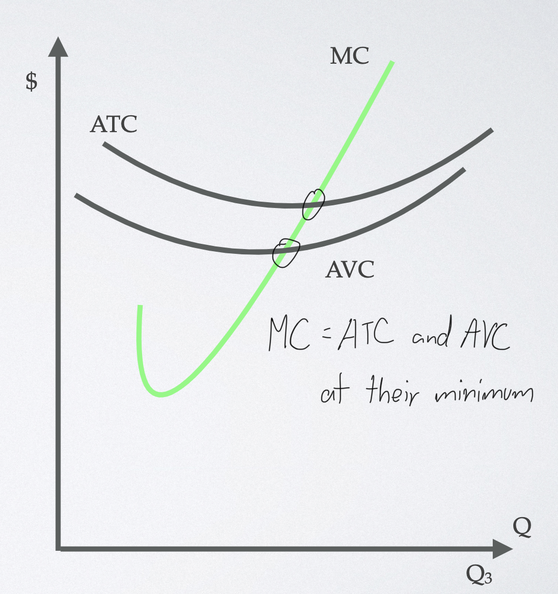

# Costs

## Short run costs

- fixed costs     -> independent of output
- variable costs  -> dependent of output

## Long run costs

- all costs are variable

---
# Short run:

#### Short run total cost curve

  

- FC are constant

#### Short run ATC curve

  

- ATC declines to Q2, increases after

#### Short run AVC curve

  

- AVC hits minimum before ATC

#### Short run marginal cost

  

- slope of ATC curve

## ATC, AVC, and MC in the short run

  

- AVC tends to ATC as output increases

---
# Long run:

## Returns to scale

| I | O || ATC |
| :-----: | :-----: | :-----: | :-----: |
| +N% | +N% | Constant | Constant |
| +N% | > N% | Increasing | Drops |
| +N% | < N% | Decreasing | Increases |