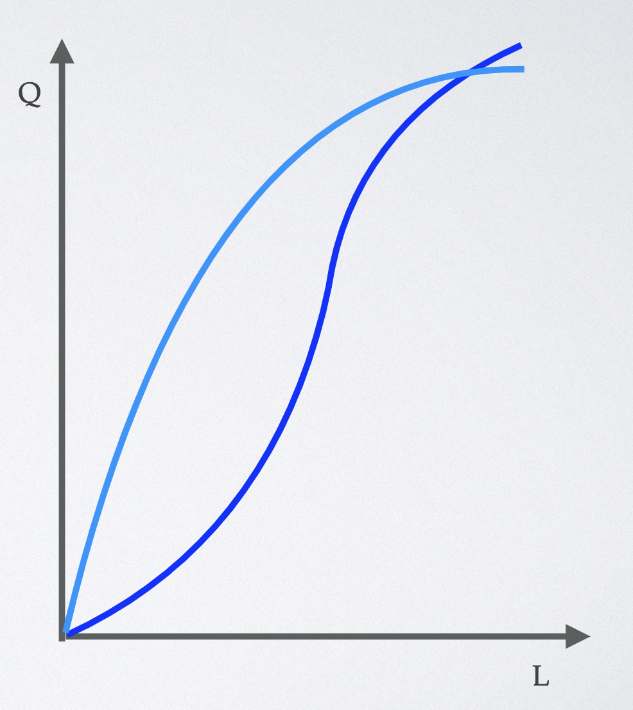
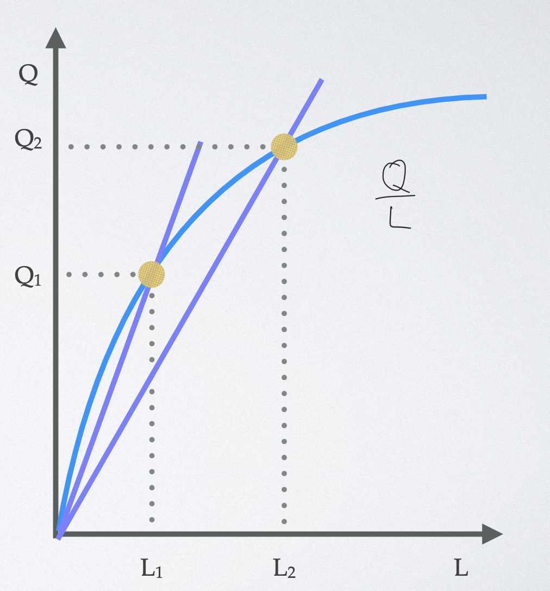
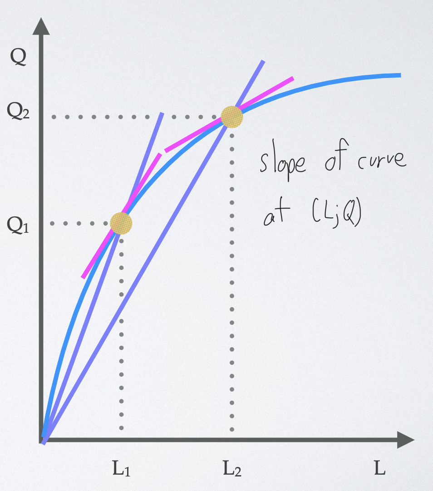

# Production

## Total Product Curve

- shows **declining marginal product** of labor

  

## Average Product of Labor

- total output divided by quantity of workers

  

## Marginal Product of Labor

- additional output gained from one worker

  
